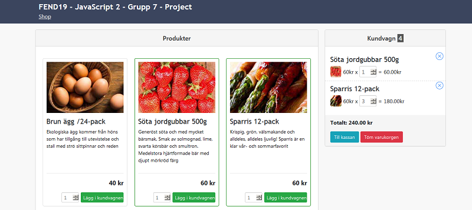
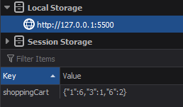

# FEND19 - JavaScript 2 – Project: Shopping cart



## Description

The purpose of this project is to develop a simple shop page with a functioning shopping cart. The work was performed in a group of three students.

## Implementation

When the store page is loaded `inventory.json` file is parsed to generate product cards. Modernizr library is used to check if users browser supports fetch API. If not, JSON is loaded with a function that uses XMLHttpRequest.

```js
$(document).ready(function() {
  // load shop items from local json file
  const INVENTORY_DIR = "json/inventory.json";
  if (Modernizr.fetch) {
    shopLib.loadJsonByFetch(INVENTORY_DIR, loadStore);
  } else {
    shopLib.loadJsonByXhr(INVENTORY_DIR, loadStore);
  }
});
```

### Populating products panel

Product cards are generated from the json object. Each

```js
  // generate item HTML and append it to store panel
  const productPanel = document.querySelector(".product-panel .panel-body");
  productsJson.forEach(item => {
    const inBasketFlag = shoppingCart[item.id] ? "in-basket" : "";
    let cardHtml = `
    <div data-item-id="${item.id}" class="product-card ${inBasketFlag}">
      <div class="product-description-wrapper">
          
          <h4 class="product-name">${item.title}</h4>
          <p class="product-description">${item.description}</p>
      </div>
      <div class="product-interaction-wrapper">
        <hr />
        <p class="product-price"><span class='product-price-value'>${item.price.value}</span> ${item.price.currency}</p>
        <button data-item-id="${item.id}" type="button" class="btn btn-success">Lägg i kundvagnen</button>
        <input data-item-id="${item.id}" type="number" min="1" max="1000" class="cart-item-qty" value="1" />
      </div>
    </div>`;
```

DOMParser API is used to create DOM elements out of generated html code so that event listeners can be attatched to input elements in the same loop. Item cards are then appended to the product panel.

```js
const itemCard = new DOMParser().parseFromString(cardHtml, "text/html");
itemCard.querySelector(`button[data-item-id="${item.id}"]`).addEventListener("click", clickAddToCartButton);
itemCard.querySelector(`input[data-item-id="${item.id}"]`).addEventListener("keyup", onKeyPressedInInputElement);
productPanel.appendChild(itemCard.querySelector("div.product-card"));
```

Data attribute is used to mark HTML elements that will trigger events to make it easy to crossreference shop windows and corresponding inventory items.

```js
<button data-item-id="${item.id}" type="button" class="btn btn-success">
  Add to cart
</button>
```

### Persisting information with shopLib.js library

A separate library was created to contain functions that persist shopping cart information and synchronize shop actions with persisted data.

Inventory item data is saved to session storage when the store is loaded for the first time.

```js
    getInventory: function() {
      const inventory = JSON.parse(sessionStorage.getItem("inventory"));
      return !inventory || Object.keys(inventory).length === 0 ? {} : inventory;
    },

    setInventory: function(inventory) {
      sessionStorage.setItem("inventory", JSON.stringify(inventory));
    },
```

Users shopping cart is saved to session storage and is updated every time an item is added or removed from the cart.

```js
    getShoppingCart: function() {
      const shoppingCart = JSON.parse(localStorage.getItem("shoppingCart"));
      return !shoppingCart || Object.keys(shoppingCart).length === 0 ? {} : shoppingCart;
    },

    setShoppingCart: function(shoppingCart) {
      localStorage.setItem("shoppingCart", JSON.stringify(shoppingCart));
    },

    clearShoppingCart: function() {
      localStorage.setItem("shoppingCart", JSON.stringify({}));
    }
```

The shopping cart is represented by a simple JSON object where item IDs are used as keys to store the quantity of the corresponding item.



### Adding items to cart

Items can be added to cart by pressing the green "Add to cart" button or selecting the corresponding input field and pressing enter. Once in the shopping cart, the desired item quantity can be adjusted with a separate input field.

```js
function addItemToShoppingCart(itemID, itemCount) {
  const shoppingCart = shopLib.getShoppingCart();
  shoppingCart[itemID] = Number(shoppingCart[itemID] + itemCount) || itemCount;
  shopLib.setShoppingCart(shoppingCart);
  updateShoppingCartWindow();
}
```

All items in the cart can be removed by pressing the "(X)" button in the top right corner.

```js
function removeItemFromShoppingCart(itemID) {
  const shoppingCart = shopLib.getShoppingCart();
  delete shoppingCart[itemID];
  shopLib.setShoppingCart(shoppingCart);
  updateShoppingCartWindow();
}
```
