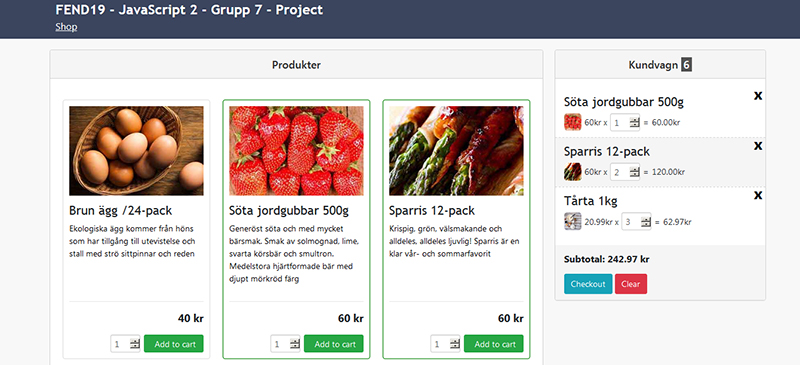

# FEND19 - JavaScript 2 – Project: Shopping cart

## Description

The purpose of this project is to develop a simple item shop in a team of three students. Shop items must be loaded from a json file.

## Implementation

### Loading shop items

### Adding items to cart

### shopLib
